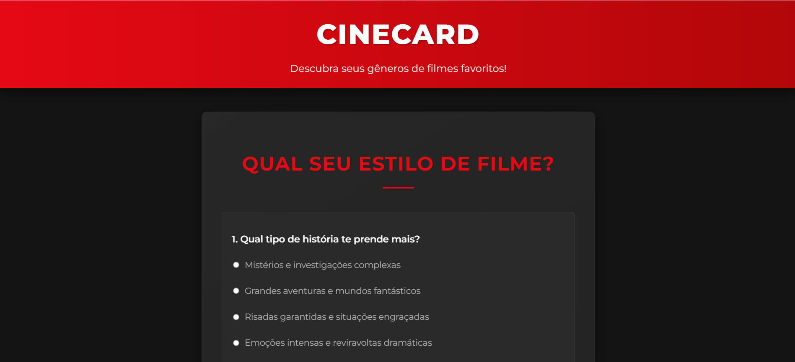
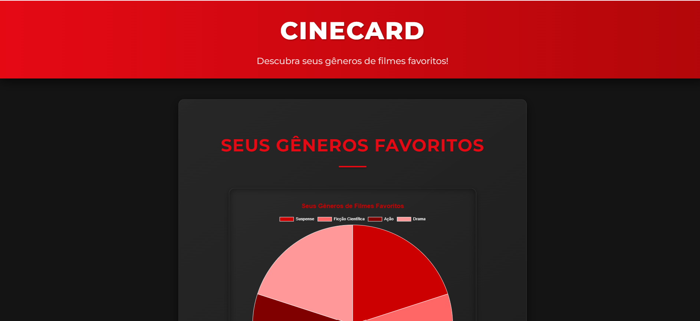

# Trabalho Prático - Semana 14

A partir dos dados disponíveis em seu projeto, vamos explorar formas de visualização que permitam apresentar essas informações de maneira clara, interativa e significativa. Você poderá utilizar gráficos (barras, linhas, pizza), mapas, calendários ou outras formas de visualização. Seu desafio é desenvolver uma página Web capaz de organizar, processar e exibir os dados de forma compreensível e visualmente atraente.

Com base no tipo de projeto escolhido, você deverá propor **visualizações que estimulem a interpretação, o agrupamento e a apresentação criativa dos dados**, trabalhando tanto os aspectos lógicos quanto os visuais da aplicação.

Sugerimos o uso das seguintes ferramentas acessíveis: [FullCalendar](https://fullcalendar.io/), [Chart.js](https://www.chartjs.org/), [Mapbox](https://docs.mapbox.com/api/), para citar algumas.

## Informações Gerais

- Nome: Maria Luiza Sousa Montaño
- Matrícula:925569
- Proposta de projeto escolhida: Quiz de Filmes
- Breve descrição sobre seu projeto: O projeto é um quiz de filmes, onde os usuários podem testar seus conhecimentos sobre cinema. Ele inclui perguntas sobre diversos gêneros, diretores, atores e enredos de filmes. O objetivo é criar uma experiência divertida e educativa para os amantes de cinema, permitindo que eles aprendam mais sobre o mundo do entretenimento enquanto se divertem.

**Print da tela com a implementação**

Nesta etapa, foi desenvolvida a interface do quiz de filmes com perguntas interativas e um gráfico em pizza que mostra os gêneros favoritos do usuário. O projeto utiliza `Chart.js` para renderizar o resultado visual e atualiza os caminhos dos recursos para garantir que o CSS e o JavaScript carreguem corretamente.

### Captura de tela 1

### Captura de tela 2

